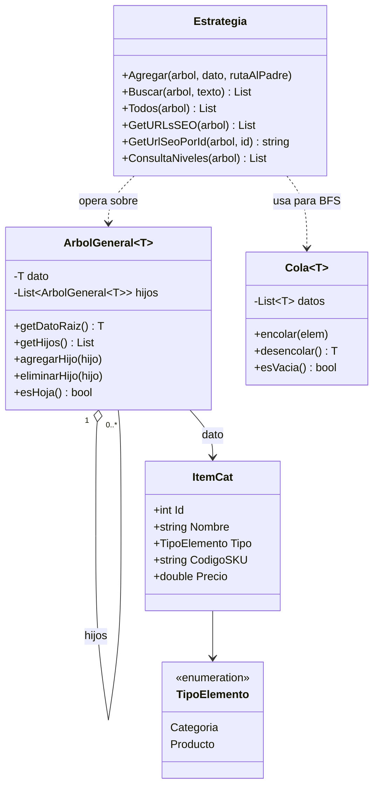
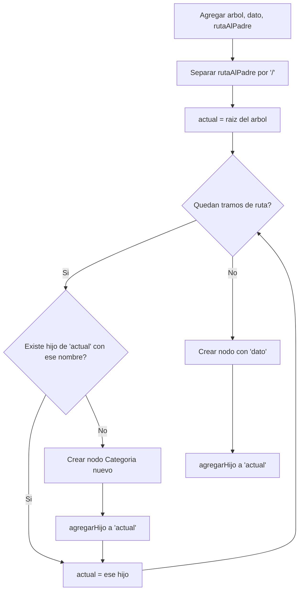

# API Catálogo — TFP Algoritmos y Estructuras de Datos

API REST que administra un catálogo de e-commerce modelado como **Árbol General**.
Trabajo Final Práctico — Primera entrega: **14/9, probablemente el 17/9**.

## Integrantes
- Santiago Pais
- Berenguera Gonzalo

## Cómo correr el proyecto
```bash
cd ApiCatalogo
dotnet run
```
La API queda disponible en `http://localhost:5000`, con Swagger en `http://localhost:5000/swagger` (te recomiendo este, ayuda mucho a saber si algo funciona).

## Estado de avance

| Método (`Estrategia.cs`) | Estado |
|---|---|
| `Todos` | 🟩 Completado (100%) |
| `Buscar` | 🟩 Completado (100%) |
| `Agregar` | 🟩 Completado (100%) |
| `GetURLsSEO` | ⬜ Pendiente (0%) |
| `GetUrlSeoPorId` | ⬜ Pendiente (0%) |
| `ConsultaNiveles` | 🟩 Completado (100%) |

## Diagrama de clases



## Algoritmo de Agregar

**Supuesto de diseño:** `rutaAlPadre` viene con las categorías separadas por `/`
(ej: `"Electronica/Computadoras/Laptops"`), siguiendo el mismo formato que las
URLs SEO del enunciado. Si el profesor indica otro formato, se ajusta solo esta parte.



## Estructura del proyecto
- `ArbolGeneral.cs`: estructura de árbol general genérica (dada por la cátedra).
- `ItemCat.cs`: dato que se almacena en cada nodo (categoría o producto).
- `Cola.cs`: cola FIFO (dada por la cátedra).
- `Estrategia.cs`: los 6 métodos pedidos por el enunciado.
- `Program.cs`: expone los endpoints REST (dado por la cátedra, no se modifica).
