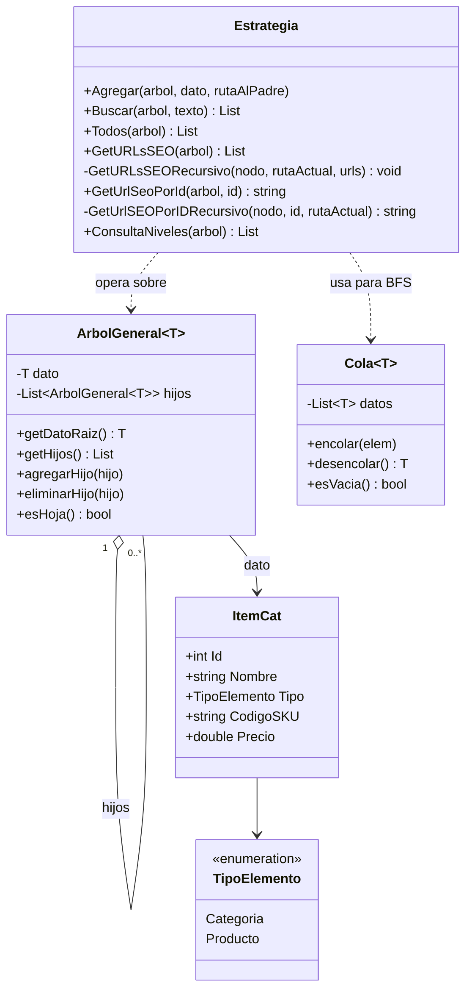
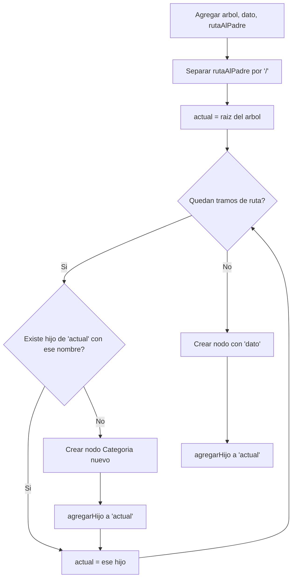

# API Catálogo — TFP Algoritmos y Estructuras de Datos

API REST que administra un catálogo de e-commerce modelado como **Árbol General**.
Trabajo Final Práctico.

## Integrantes
- Santiago Pais
- Berenguera Gonzalo

## Estado de avance

| Método (`Estrategia.cs`) | Estado |
|---|---|
| `Todos` | 🟩 Completado (100%) |
| `Buscar` | 🟩 Completado (100%) |
| `Agregar` | 🟩 Completado (100%) |
| `GetURLsSEO` | 🟩 Completado (100%) |
| `GetUrlSeoPorId` | 🟩 Completado (100%) |
| `ConsultaNiveles` | 🟩 Completado (100%) |

## Diagrama de clases

## Algoritmo de Agregar

**Supuesto de diseño:** `rutaAlPadre` viene con las categorías separadas por `/`
(ej: `"Electronica/Computadoras/Laptops"`), siguiendo el mismo formato que las
URLs SEO del enunciado. Si el profesor indica otro formato, se ajusta solo esta parte.

